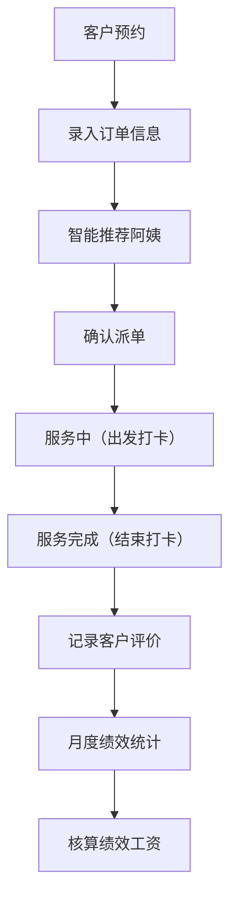

## 1. 产品概述

家政公司派单与工时管理系统，专为中小家政公司设计，解决阿姨技能管理、客户预约派单、工时记录、绩效统计和保险提醒等核心业务痛点。目标用户为家政公司管理者/调度员，通过系统化管理提升派单效率、准确核算工时与绩效、降低保险漏保风险。

## 2. 核心功能

### 2.1 用户角色

| 角色 | 登录方式 | 核心权限 |
|------|----------|----------|
| 管理员（调度员） | 直接进入系统 | 阿姨管理、订单创建与派单、工时打卡、评价记录、绩效统计、保险管理 |

### 2.2 功能模块

1. **仪表盘首页**：今日订单概览、保险到期提醒、关键数据统计卡片
2. **阿姨管理**：阿姨信息维护、技能标签管理、保险信息录入与到期提醒
3. **预约派单**：客户预约录入、智能推荐阿姨、手动调整派单
4. **工时打卡**：服务出发/结束打卡、自动计算工时、服务状态跟踪
5. **绩效统计**：按月统计每位阿姨的工时、好评数、绩效工资
6. **评价管理**：记录客户好评/差评、查看评价历史

### 2.3 页面详情

| 页面名称 | 模块名称 | 功能描述 |
|---------|---------|----------|
| 仪表盘 | 数据概览卡片 | 今日订单数、进行中订单、待派单、保险到期提醒 |
| 仪表盘 | 今日订单列表 | 展示当日所有订单及状态，快速操作入口 |
| 仪表盘 | 保险提醒区域 | 显示即将到期的保险，高亮紧急项 |
| 阿姨管理 | 阿姨列表 | 展示所有阿姨信息，支持搜索筛选 |
| 阿姨管理 | 新增/编辑阿姨 | 录入姓名、电话、技能标签、入职日期、保险信息 |
| 阿姨管理 | 技能标签管理 | 维护技能类型（擦玻璃、地板打蜡、油烟机清洗等） |
| 预约派单 | 新建预约 | 录入客户信息、服务时间、地址、服务类型、备注 |
| 预约派单 | 智能推荐 | 根据技能匹配和时间空闲自动推荐合适阿姨 |
| 预约派单 | 订单列表 | 展示所有订单，支持按状态/时间筛选 |
| 工时打卡 | 进行中订单 | 显示当前正在服务的订单，出发/结束打卡按钮 |
| 工时打卡 | 工时记录 | 查看历史工时明细，支持编辑调整 |
| 绩效统计 | 月度统计表 | 按月份展示每位阿姨的总工时、好评数、差评数、绩效工资 |
| 绩效统计 | 绩效详情 | 查看单个阿姨的月度明细 |
| 评价管理 | 评价列表 | 所有客户评价记录，支持筛选和查看 |

## 3. 核心流程

### 3.1 派单流程
客户电话预约 → 调度员录入预约信息（时间、地址、服务类型）→ 系统自动推荐具备对应技能且时间空闲的阿姨 → 调度员确认派单 → 系统生成订单并通知安排

### 3.2 服务打卡流程
阿姨出发前 → 调度员点击"出发打卡"记录开始时间 → 阿姨到达服务 → 服务完成后 → 调度员点击"结束打卡"记录结束时间 → 系统自动计算工时 → 录入客户评价

### 3.3 绩效核算流程
选择统计月份 → 系统汇总每位阿姨的订单工时 → 统计好评/差评数量 → 根据预设绩效规则计算工资 → 导出或查看报表

## 4. 用户界面设计

### 4.1 设计风格
- **主色调**：温暖的橙色系（#FF7A45），传达家政服务的亲切与活力
- **辅助色**：深青色（#0D9488）用于成功/好评状态，红色（#EF4444）用于警告/差评/紧急提醒
- **中性色**：暖灰色系，营造干净专业的后台管理氛围
- **按钮风格**：圆角矩形（rounded-lg），主按钮橙色渐变，悬停有微上浮效果
- **字体**：中文使用系统无衬线字体，标题加粗，正文清晰易读
- **布局风格**：左侧导航 + 右侧内容区的经典后台布局，卡片式内容展示
- **图标风格**：使用 lucide-react 线性图标，与整体简约风格统一

### 4.2 页面设计概览

| 页面名称 | 模块名称 | UI 元素 |
|---------|---------|---------|
| 仪表盘 | 数据卡片 | 四列卡片网格，带图标、数值、同比变化指示 |
| 仪表盘 | 今日订单 | 时间线式布局，不同状态用颜色标签区分 |
| 仪表盘 | 保险提醒 | 红色/黄色警示卡片，按紧急程度排序 |
| 阿姨管理 | 阿姨列表 | 卡片式列表，头像、姓名、技能标签、状态徽章 |
| 预约派单 | 推荐列表 | 阿姨卡片并排展示，匹配度高亮显示 |
| 工时打卡 | 打卡按钮 | 大尺寸主按钮，出发/结束两种状态切换 |
| 绩效统计 | 统计表格 | 斑马纹表格，关键数据加粗高亮 |

### 4.3 响应式
- 桌面端优先设计（最小宽度 1280px）
- 平板端适配：侧边栏可折叠
- 移动端：简化导航为底部 Tab 栏，表格转为卡片式展示

### 4.4 动效与交互
- 页面切换时的淡入过渡
- 按钮悬停的微放大与阴影加深
- 数据加载时的骨架屏脉冲动画
- 状态变更时的轻量 Toast 提示
- 打卡按钮按下的缩放反馈
