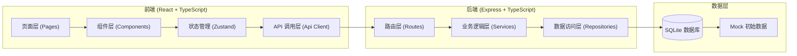
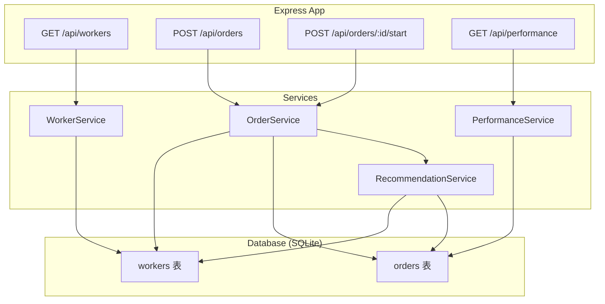
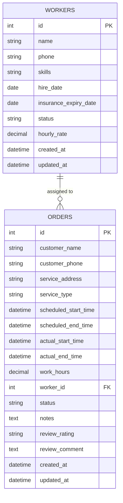

## 1. 架构设计



## 2. 技术描述

- **前端**：React@18 + TypeScript + Vite + Tailwind CSS@3 + Zustand + React Router DOM + Lucide React
- **初始化工具**：vite-init (react-express-ts 模板)
- **后端**：Express@4 + TypeScript
- **数据库**：SQLite (better-sqlite3)
- **数据存储**：本地 SQLite 文件，初始化时自动建表并导入 mock 数据
- **状态管理**：Zustand 管理前端全局状态
- **HTTP 客户端**：原生 fetch 封装

## 3. 路由定义

| 前端路由 | 页面组件 | 功能 |
|---------|---------|------|
| /dashboard | DashboardPage | 仪表盘首页，数据概览 + 今日订单 + 保险提醒 |
| /workers | WorkersPage | 阿姨列表管理 |
| /workers/new | WorkerFormPage | 新增阿姨 |
| /workers/:id/edit | WorkerFormPage | 编辑阿姨 |
| /orders | OrdersPage | 订单列表 |
| /orders/new | OrderFormPage | 新建预约 + 智能派单 |
| /time-tracking | TimeTrackingPage | 工时打卡 |
| /performance | PerformancePage | 绩效统计 |
| /reviews | ReviewsPage | 评价管理 |

## 4. API 定义

### 4.1 阿姨管理 API

| 方法 | 路径 | 描述 |
|------|------|------|
| GET | /api/workers | 获取阿姨列表，支持技能筛选 |
| GET | /api/workers/:id | 获取阿姨详情 |
| POST | /api/workers | 新增阿姨 |
| PUT | /api/workers/:id | 更新阿姨信息 |
| DELETE | /api/workers/:id | 删除阿姨 |
| GET | /api/workers/available?serviceType=&startTime=&endTime= | 查询指定时间可用且具备指定技能的阿姨 |

### 4.2 订单管理 API

| 方法 | 路径 | 描述 |
|------|------|------|
| GET | /api/orders | 获取订单列表，支持状态/日期筛选 |
| GET | /api/orders/:id | 获取订单详情 |
| POST | /api/orders | 创建订单（派单） |
| PUT | /api/orders/:id | 更新订单信息 |
| DELETE | /api/orders/:id | 取消订单 |
| POST | /api/orders/:id/start | 开始服务（出发打卡） |
| POST | /api/orders/:id/end | 结束服务（结束打卡） |
| POST | /api/orders/:id/review | 添加客户评价 |

### 4.3 绩效统计 API

| 方法 | 路径 | 描述 |
|------|------|------|
| GET | /api/performance?month=YYYY-MM | 获取月度绩效统计 |
| GET | /api/performance/workers/:id?month=YYYY-MM | 获取单个阿姨月度绩效详情 |

### 4.4 保险提醒 API

| 方法 | 路径 | 描述 |
|------|------|------|
| GET | /api/insurance/expiring?days=30 | 获取 N 天内即将到期的保险 |

### 4.5 数据类型定义

```typescript
// 阿姨信息
interface Worker {
  id: number;
  name: string;
  phone: string;
  avatar?: string;
  skills: string[];
  hireDate: string;
  insuranceExpiryDate: string;
  status: 'active' | 'inactive';
  hourlyRate: number;
  createdAt: string;
  updatedAt: string;
}

// 订单状态
type OrderStatus = 'pending' | 'assigned' | 'in_progress' | 'completed' | 'cancelled';

// 订单信息
interface Order {
  id: number;
  customerName: string;
  customerPhone: string;
  serviceAddress: string;
  serviceType: string;
  scheduledStartTime: string;
  scheduledEndTime: string;
  actualStartTime?: string;
  actualEndTime?: string;
  workHours?: number;
  workerId?: number;
  status: OrderStatus;
  notes?: string;
  review?: {
    rating: 'positive' | 'negative' | 'neutral';
    comment?: string;
  };
  createdAt: string;
  updatedAt: string;
}

// 月度绩效
interface MonthlyPerformance {
  workerId: number;
  workerName: string;
  month: string;
  totalOrders: number;
  totalHours: number;
  positiveReviews: number;
  negativeReviews: number;
  baseSalary: number;
  bonus: number;
  totalSalary: number;
}
```

## 5. 服务端架构图



## 6. 数据模型

### 6.1 数据模型 ER 图



### 6.2 数据库建表语句

```sql
-- 阿姨表
CREATE TABLE IF NOT EXISTS workers (
  id INTEGER PRIMARY KEY AUTOINCREMENT,
  name TEXT NOT NULL,
  phone TEXT,
  skills TEXT DEFAULT '[]',
  hire_date TEXT,
  insurance_expiry_date TEXT,
  status TEXT DEFAULT 'active',
  hourly_rate REAL DEFAULT 25.0,
  created_at TEXT DEFAULT CURRENT_TIMESTAMP,
  updated_at TEXT DEFAULT CURRENT_TIMESTAMP
);

-- 订单表
CREATE TABLE IF NOT EXISTS orders (
  id INTEGER PRIMARY KEY AUTOINCREMENT,
  customer_name TEXT NOT NULL,
  customer_phone TEXT,
  service_address TEXT,
  service_type TEXT NOT NULL,
  scheduled_start_time TEXT NOT NULL,
  scheduled_end_time TEXT NOT NULL,
  actual_start_time TEXT,
  actual_end_time TEXT,
  work_hours REAL,
  worker_id INTEGER,
  status TEXT DEFAULT 'pending',
  notes TEXT,
  review_rating TEXT,
  review_comment TEXT,
  created_at TEXT DEFAULT CURRENT_TIMESTAMP,
  updated_at TEXT DEFAULT CURRENT_TIMESTAMP,
  FOREIGN KEY (worker_id) REFERENCES workers(id)
);

-- 索引
CREATE INDEX IF NOT EXISTS idx_orders_status ON orders(status);
CREATE INDEX IF NOT EXISTS idx_orders_worker_id ON orders(worker_id);
CREATE INDEX IF NOT EXISTS idx_orders_scheduled_start ON orders(scheduled_start_time);
CREATE INDEX IF NOT EXISTS idx_workers_status ON workers(status);
```

### 6.3 初始 Mock 数据

- 10 位保洁阿姨，每人配置 2-3 项技能
- 15-20 条历史订单（包含各种状态）
- 3 条保险将在 30 天内到期的阿姨
- 5 条客户评价记录
- 技能类型：擦玻璃、地板打蜡、油烟机清洗、日常保洁、深度保洁
